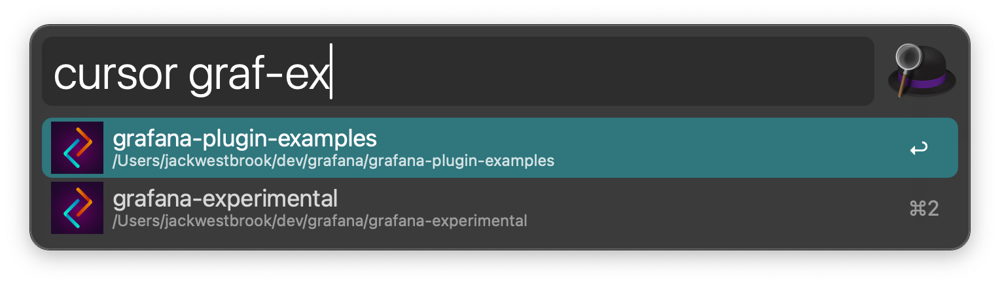
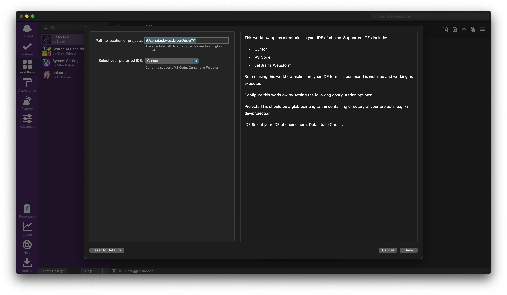

# Open in IDE Alfred Workflow

This workflow opens directories in your IDE of choice using fuzzy search. Supported IDEs include:

- Cursor
- VS Code
- JetBrains Webstorm

> [!IMPORTANT]
> Before using this workflow make sure your IDE terminal command is installed, available in $PATH, and you can open directories/files directly from terminal. e.g. `cursor ~/dev/myproject`.



## Installation

### NPM

```bash
npm install -g alfred-open-in-ide
```

### Github releases

1. Download the latest release from the [releases page](https://github.com/jackw/alfred-open-in-ide/releases)
2. Double-click the downloaded `.alfredworkflow` file to install
3. Alfred will prompt you to import the workflow - click "Import"

## Usage

### Configuration

1. Open Alfred Preferences
2. Go to the Workflows tab
3. Find "Open in IDE" in your workflows list
4. Click the workflow to open its settings
5. Click the "Configure" button to open the configuration panel



In the configuration panel, you can:

- **Projects Directory**: Set the path to your projects directory using glob patterns. For example:

  - `~/Projects/*` - All directories in your Projects folder
  - `~/Projects/*/*` - All directories and their immediate directories in your Projects folder
  - `~/Projects/{project1,project2}` - Specific projects

- **IDE Selection**: Choose your preferred IDE from the dropdown menu. Available options:
  - Cursor (default)
  - Visual Studio Code
  - WebStorm

### Activation

Once configured the Alfred keyword will match the name of your chosen IDE (`cursor`, `code`, or `webstorm`). Open alfred, type the name of your chosen IDE followed by a space, now begin typing the name of the directory/project you want to open.

## Development

### Prerequisites

- Node.js 20 or later
- pnpm 10 or later
- Alfred 5 or later

### Setup

1. Clone the repository:

   ```bash
   git clone https://github.com/jackw/alfred-open-in-ide.git
   cd alfred-open-in-ide
   ```

2. Install dependencies:

   ```bash
   npm install
   ```
> [!Note]
> This will also install the workflow in Alfred.

3. Start development mode:
   ```bash
   npm start
   ```

### Building

To build the workflow for distribution:

```bash
pnpm build
```

### Testing

Run the test suite:

```bash
pnpm test
```

### Contributing

1. Fork the repository
2. Create your feature branch (`git checkout -b feature/amazing-feature`)
3. Commit your changes (`git commit -m 'Add some amazing feature'`)
4. Push to the branch (`git push origin feature/amazing-feature`)
5. Open a Pull Request

## License

This project is licensed under the MIT License - see the [LICENSE](LICENSE) file for details.

## Thanks

This workflow wouldn't exist without these awesome projects:

- https://github.com/sindresorhus/alfy
- https://github.com/vivaxy/alfred-open-in-vscode
- https://github.com/leeoniya/uFuzzy
